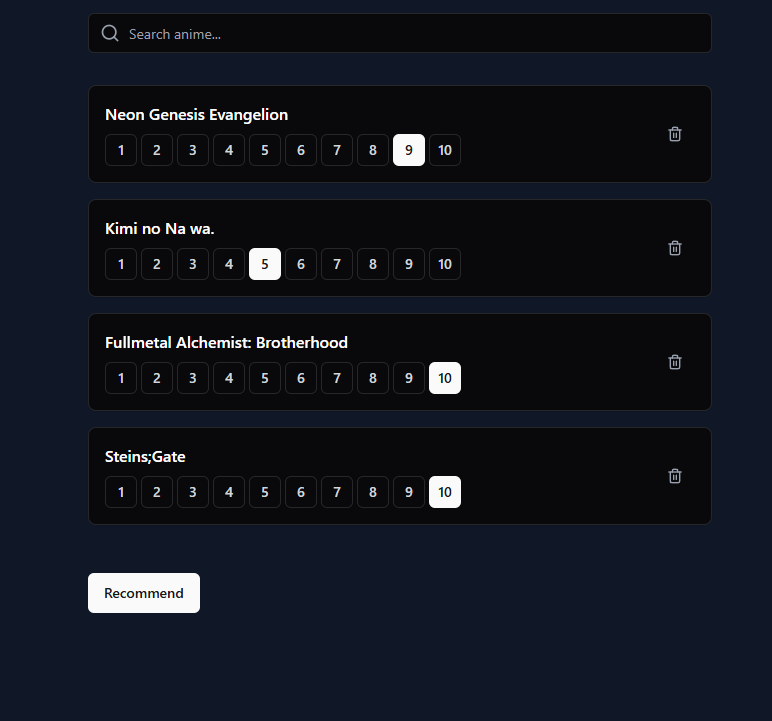
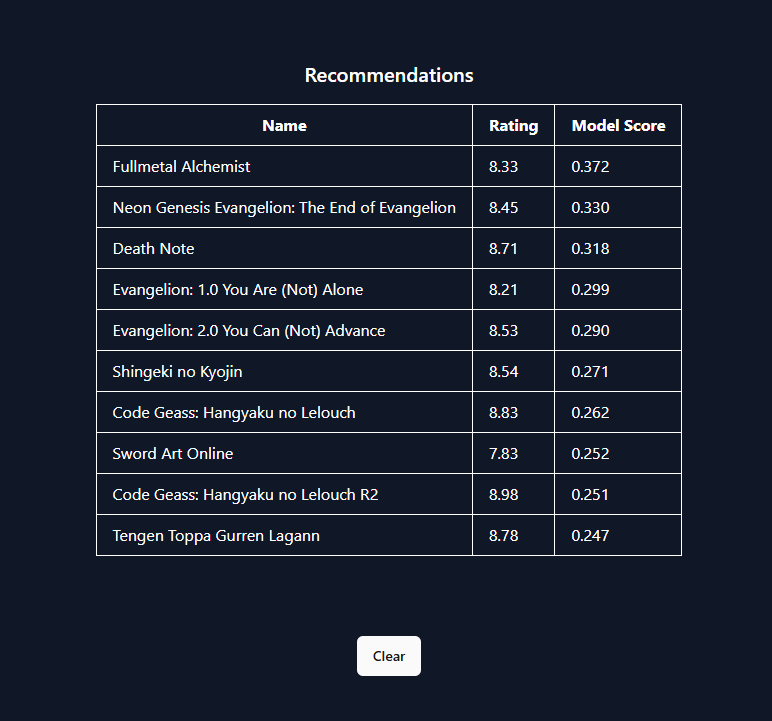

# AI Recommender system for anime series

## About project
In this project we analyze various models that can be used for a recommender system (in our case - for anime series) - from basic KNN to ALS.

## Models

### KNN System

### xyz System

### ALS System
The recommender system leverages Matrix Factorization (MF), a machine learning technique for modeling relationships in high-dimensional data. Commonly used in recommendation systems and collaborative filtering, MF decomposes a matrix into lower-dimensional matrices whose product approximates the original. This method excels at handling sparse data, such as user-item interactions.

## Project structure
### `backend`
- contains couple of `.pkl` files with model and preprocessed input data
- `generate_and_save_model.py` allows to regenerate those files
- `app.py` is flask backend server that is used by frontend app
### `data`
- if you run our code, you should fill it with datasets from [kaggle](https://www.kaggle.com/datasets/CooperUnion/anime-recommendations-database). We don't upload it because files are too large for github
### `frontend`
- contains react/typescript website that allows users to get recommendations using convienient, user-friendly UI
### `generated_data`
- `genre_list.json` is list generated from base data
### `img`
- directory for images used in ipynb notebooks
### `model`
- `analysis_for_11.ipynb` explores input data for user 11 (which is used as example in one of the models)
- `model_reworked.py` contains base ALS system code
- `model.py` contains old version of ALS system code
- `ModelOverviewAnimeRecSysMLProject.ipynb` goes over ALS model code - from creation and training to a example
### `svd_model`
- `model.py` contains SVD system code
- `modelOverview.ipynb` is overview of SVD model, contains simple math explanation, coded function and some testing
- `modelTests.py` contains tests on kaggle data
- `predictions.csv` contains list of data predicted with SVD
### `naive_model`
- `NaiveModelOverview.ipynb` is overview of naive, KNN model

## Running the code
- You can check out both models in `.ipynb` files
- If you want to run them by your own, you need to download the data:
### Getting data
1. Download both data sets from https://www.kaggle.com/datasets/CooperUnion/anime-recommendations-database
2. Create a directory named 'data' in the repo folder
3. Extract rating dataset and place it in data along with the anime dataset
4. Done :3
### Running UI
- open terminal
- run `app.py`
- open another terminal
- `cd` into `frontend`
- `npm i` (only needs to be run once)
- `npm run dev`
You now have both backend and frontend running. 

## Using UI
- Use searchbar at the top to select series. Rate them out of 10. More series you rate, the more accurate model will be. When you are finished, click `Recommend`
  

- API will return 10 recommendations for you, along with ratings and model score.

### Authors:
* Anna Pierzchała
* Bartosz Marchewka
* Karolina Kępa
* Wojciech Woźniak